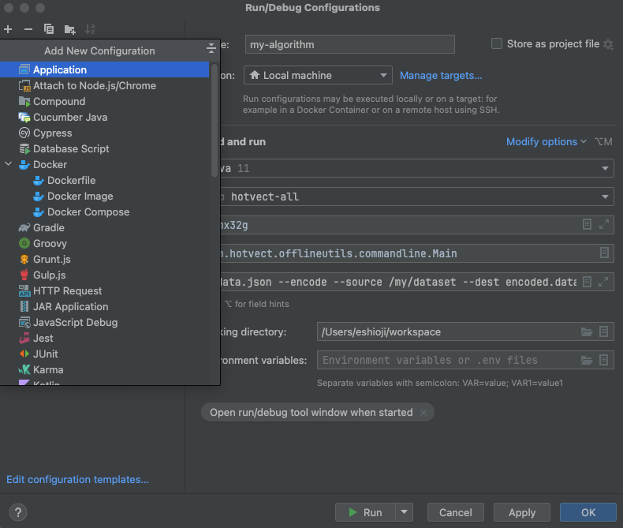
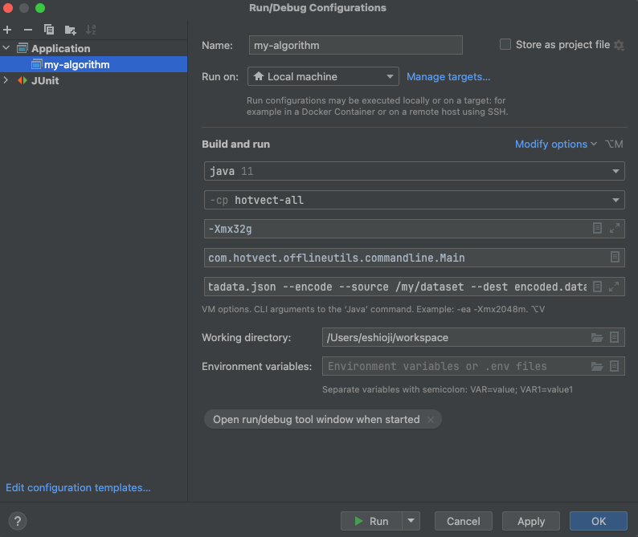
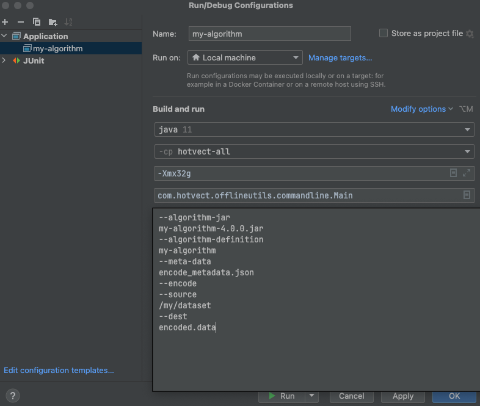
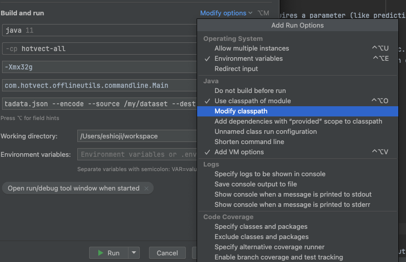
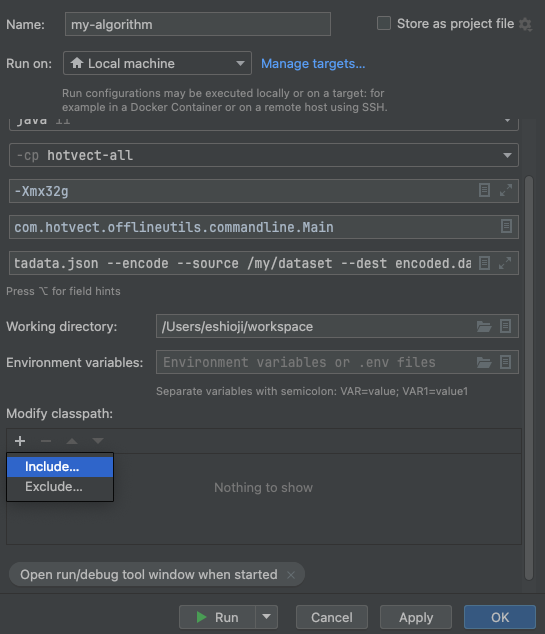
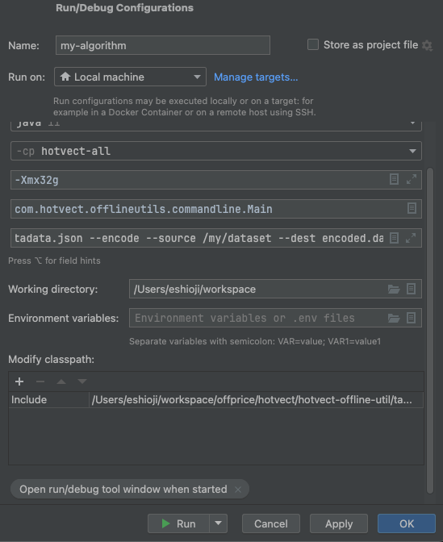

# How to: Debug feature engineering code (algorithm jars)

## What do you mean with feature engineering code (algorithm jars)?
In hotvect, the logic for calculating feature values are written in the "algorithm jars", which are algorithm packages that can be deployed on business applications.

## Why do I need to know how to debug feature engineering code?
You can unit test code in the algorithm jar like any other code, but sometimes issues are data dependent (they only happen with certain data). For such cases, it's useful to be able to run the algorithm jar on a large data set, and debug the code when the error occurs.

## Prerequisite knowledge
Most Java applications work by putting your code in the "classpath" (e.g. `java -cp myjar.jar com.mycompany.MyClass`). Hotvect works slightly different. Instead of the algorithm jar being part of the class path when the JVM is launched, it is loaded dynamically by hotvect using the command line option `--algorithm-jar`. This is similar to how frameworks like Spark, Tomcat works. This means that you cannot debug the algorithm jar by running it directly. Instead, you need to run it using the hotvect-offline-util jar, which is a command line tool for running hotvect algorithms. 

## How to debug

### Locating the hotvect-offline-util jar
The hotvect-offline-util jar is located in the maven repository. You can download it from the maven repository, or if you have the python library installed, you can also use the jar that is bundled with it. To locate the bundled jar, execute the following python code:

```python
>>> import hotvect.hotvectjar
>>> hotvect.hotvectjar.HOTVECT_JAR_PATH
PosixPath('/Users/abcdef/hotvect/hotvectjar/hotvect-offline-util-x.y.z-jar-with-dependencies.jar')
```

### Running the algorithm jar
Once you have located the hotvect-offline-util jar, you can run the algorithm jar as follows:
```bash
java -cp <path-to-hotvect-offline-util-jar>/hotvect-offline-util-x.y.z-jar-with-dependencies.jar \
-Xmx32g -XX:+ExitOnOutOfMemoryError \
com.hotvect.offlineutils.commandline.Main \
--algorithm-jar <path-to-algorithm-jar>/my-algorithm-a.b.c.jar \
--algorithm-definition <my-algorithm-name> \
--meta-data <path-to-write-metadata-output> \
--encode \
--source <path-to-dataset> \
--dest <path-to-write-output> \
--parameters <path-to-parameter-files>
```

The parameters are as follows:
 - `--algorithm-jar`: The path to the algorithm jar
 - `--algorithm-definition`: The name of the algorithm. Hotvect uses this to locate the correct algorithm-definition.json to run.
 - `--meta-data`: The path to the metadata file. This file will be written by the command line tool. It contains information about the execution, such as performance metrics.
 - `--encode`: This option tells the command line tool to run the algorithm in encode mode. You can also use other modes for debugging, such as `--predict`, `--audit`.
 - `--source`: The path to the data set on which the algorithm should be run. This can be a file or a directory.
 - `--dest`: The path to write the encoded (or predicted, or audited) data to.
 - `--parameters`: The path to the parameter zip package. Only necessary if the operation requires a parameter (like prediction with a ML model).

### Debugging the algorithm jar
By executing the above command in your IDE, you can debug the algorithm jar. You can set breakpoints, inspect variables, etc. To do this, open the algorithm jar project in your IDE. Then, in the debug configuration, specify the classpath to include the hotvect-offline-util jar, and set the main class to `com.hotvect.offlineutils.commandline.Main`, and the program arguments to the arguments above.

In Intellij, the steps are as follows:

 - First, open the algorithm project in Intellij. Then, create a new run configuration as follows:



 - Set the main class to `com.hotvect.offlineutils.commandline.Main` and edit the JVM arguments (like Xmx) as needed.



 - Set the program arguments to the arguments above.



 - Finally, set the classpath to include the hotvect-offline-util jar.





Now you can run and debug the algorithm jar as you would any other Java application.

