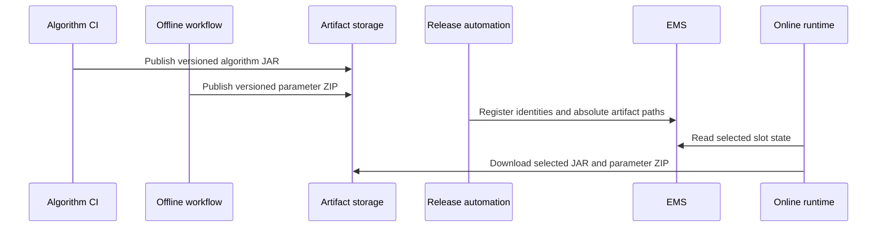

# Artifact publication and storage

Hotvect keeps executable bytes separate from control-plane metadata. The artifact path carries the JAR or parameter ZIP;
EMS records which immutable paths belong to a released runtime identity.

## Three distinct publication steps

| Step | Produces | Typical owner |
| --- | --- | --- |
| Publish algorithm code | Versioned algorithm JAR | Algorithm CI pipeline |
| Publish trained or generated state | Versioned predict-parameters ZIP | Offline workflow and release automation |
| Register release metadata | Algorithm and parameter records with exact artifact paths | Authorized release automation or operator |

Completing one step does not imply the others. Building a JAR does not train parameters. Uploading a parameter ZIP does
not activate it. Registering metadata does not upload either artifact.

## Data flow

The current built-in download client reads S3 URIs. A containing application can implement `AlgorithmDownloadClient`
for another store, but the same separation remains: EMS selects metadata, and the runtime retrieves bytes from the
artifact store.

## Required metadata

An online release needs enough metadata to resolve:

- algorithm name and version;
- parameter ID;
- absolute algorithm-JAR location;
- absolute parameter-ZIP location;
- optional training-image or release metadata used by surrounding workflows.

Artifact locations are deployment-specific, so the EMS server does not derive them from naming conventions. Parameter
registration must supply `absolute_s3_path`; algorithm registration likewise supplies the JAR location.

## Immutability

Treat algorithm IDs, parameter IDs, and their paths as immutable. The online repository retains factories by algorithm
ID and reuses instances by algorithm ID plus parameter ID. Replacing bytes under an existing identity can produce
different behavior across already-running and newly-started processes.

Publish changed bytes under a new identity, verify the new runtime, and update selection metadata through the release
workflow.

## Security and operations

Artifact storage and EMS require different permissions:

- algorithm CI needs artifact write access;
- offline publication needs parameter write access;
- the online runtime needs artifact read access and EMS read access;
- experiment automation needs only the EMS mutations it performs;
- EMS itself does not need permission to download or execute algorithm artifacts.

The deployment owner decides retention, replication, encryption, integrity controls, and recovery for artifact storage.
The current classloader validates identity metadata but does not provide a cryptographic artifact-signature boundary.

Continue with [Artifacts and identity](../../concepts/artifacts-and-identity/index.md) for the identity model and
[Take a change to a live experiment](../../guides/change-to-live-experiment/index.md) for the release workflow.
