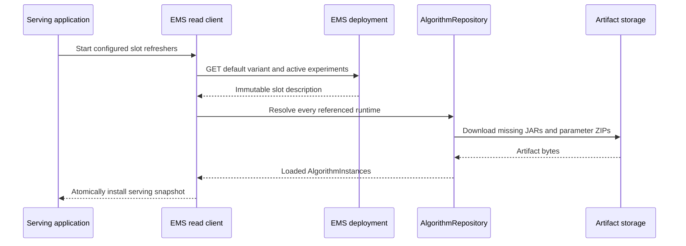

# EMS runtime client, refresh, and assignment

The EMS runtime client is part of `hotvect-online-util`. A containing Java serving application embeds it to select and
load released algorithms from a separately deployed EMS control plane.

The client is not the EMS server. It does not persist experiments or expose administrative endpoints.

## Dependency placement

The containing serving application depends on:

```text
com.hotvect:hotvect-online-util:<hotvect-version>
```

It does not embed the standalone EMS server. The application also supplies its HTTP framework,
credentials, artifact-store client, scratch storage, public API, and any application-owned algorithm bindings.

## Refresh lifecycle



Each configured slot has a refresher. Startup performs an initial refresh before the manager becomes ready. Later
refreshes run on the configured period.

The slot's total shard count is initialized from the first successful payload and treated as immutable for that
refresher's lifetime. Changing it requires a coordinated process restart rather than silently changing the hash space
inside a running process.

## Artifact resolution and reuse

The runtime converts the EMS response into exact algorithm and parameter identities. `AlgorithmRepository` then:

- retains an `AlgorithmInstanceFactory` for each algorithm ID;
- reuses a live `AlgorithmInstance` for the same algorithm ID and parameter ID;
- downloads a new parameter package when a new identity is selected;
- supplies application-provided dependency overrides during construction;
- closes an algorithm after its instance becomes unreachable.

All algorithms referenced by the default variant and active experiments must resolve before the new snapshot is
installed. This prevents one request from observing a partially updated experiment graph.

## Built-in parameter-age metric

Pass a Micrometer `MeterRegistry` to `AlgorithmRepository` to register one gauge for each loaded parameterized
instance:

```text
ems.algorithm_parameter.age
```

The value is the number of seconds since `algorithm-parameters.json.ran_at`. Its tags are:

| Tag | Value |
| --- | --- |
| `AlgorithmName` | Full algorithm ID in `name@version` form |
| `AlgorithmParameterId` | Loaded parameter ID |

No gauge is registered for an instance without parameter metadata. A registered gauge reports `-1` when `ran_at` is
unavailable. It follows the lifetime of the weakly cached `AlgorithmInstance`, so a runtime no longer referenced by a
serving snapshot can disappear after collection.

This metric measures parameter age, not EMS refresh age. The default public manager interface exposes the current
snapshot but does not expose its per-slot last-failure timestamp. A containing application that needs structured
refresh health must add that integration explicitly and should not infer it from parameter age.

## Request path

Once a snapshot is installed, request-time selection is local:


The first applicable rule determines the selected variant. The selected `VariantConfiguration` contains both the
variant metadata and its already-loaded `AlgorithmInstance`.

The request does not call EMS and does not download an artifact. The containing application calls the selected
algorithm locally and maps its result into the application's response.

Record at least the selected slot, variant ID, algorithm ID, parameter ID, and full runtime ID with request metrics or
traces. Parameter age alone cannot attribute a decision to an experiment or distinguish two variants using the same
runtime.

## Assignment key ownership

The containing application chooses the stable domain identifier passed as the assignment key. That choice determines
stickiness and must remain consistent across request paths that are expected to receive the same experiment assignment.

Hotvect hashes the assignment key together with slot and experiment salts. It does not infer which customer, session,
device, or request identifier is correct for the application's product semantics.

## Application-provided dependencies

The application may construct one shared `AlgorithmRepository` with named `AlgorithmInstance` overrides. This is how a
host can supply an application-owned capability such as a feature-store adapter.

The algorithm sees the bound interface, while the application remains responsible for the implementation's credentials,
transport, batching, timeouts, metrics, failure behavior, and lifecycle. Read
[Online runtime integration](../../architecture/online-runtime/index.md) for the complete loading boundary.

## Failure behavior

Initial and background failures have different operational consequences:

| Failure | Runtime behavior | Application decision |
| --- | --- | --- |
| Initial EMS read fails | No serving snapshot exists | Usually fail startup or readiness |
| Initial artifact resolution fails | No complete snapshot is installed | Usually fail startup or readiness |
| Later EMS read fails | Previous successful snapshot remains installed | Report staleness and choose health/traffic policy |
| Later artifact resolution fails | Candidate snapshot is discarded | Continue with previous snapshot and surface failure |
| Per-request algorithm fails | Request execution fails inside the host | Map to the application's error and observability policy |

Hotvect records refresh failure and staleness information, but it does not invent a fallback algorithm or silently
switch to an unrelated deployment.

## Lifecycle and resources

Create one `AlgorithmRepository` per application and share it across slots and request threads. Keep strong references
to selected `AlgorithmInstance` wrappers for as long as their algorithms are in use.

On shutdown:

1. stop the experimentation manager and its slot refreshers;
2. close the EMS HTTP client;
3. close the artifact download client;
4. close application-owned artifact-store clients and dependency bindings.

The containing application owns scratch capacity, optional runtime-local state storage, credentials, and process
shutdown ordering.

Continue with [Connect an online runtime to EMS](../../guides/connect-online-runtime-to-ems/index.md) for a concrete Java
integration.
