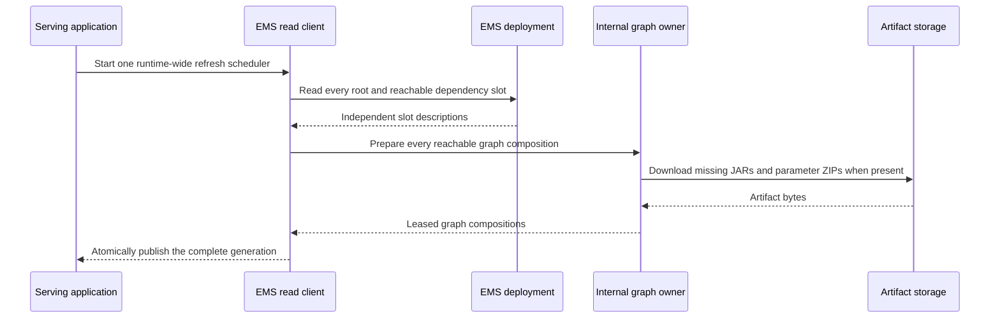

# EMS runtime client, refresh, and assignment

The EMS runtime client is part of `hotvect-online-util`. A containing Java serving application embeds it to load and
invoke released algorithms selected by a separately deployed EMS control plane.

The client is not the EMS server. It does not persist experiments or expose administrative endpoints.

## Dependency placement

The containing serving application depends on:

```text
com.hotvect:hotvect-online-util:<hotvect-version>
```

It does not embed the standalone EMS server. The application also supplies its HTTP framework,
credentials, artifact-store client, scratch storage, public API, and any application-owned algorithm bindings.

## Refresh lifecycle



One scheduler refreshes all configured roots and every recursively referenced slot. Startup prepares a complete
snapshot before the runtime becomes ready. A background cycle publishes one immutable generation only after every
slot, artifact, dependency binding, and serving contract validates. Request threads continue using the previous
generation during preparation and observe the new generation through one atomic publication; they do not take a
refresh lock.

EMS slot reads are independent HTTP operations. Complete local publication prevents a process-local partial update,
but it does not turn those reads into a transactional EMS snapshot.

## Artifact resolution and reuse

The runtime converts the EMS response into exact algorithm identities and optional parameter identities. Its internal
graph repository then:

- indexes downloaded artifacts and composed graphs while they have live leases;
- reuses every live graph whose artifact, parameter, and effective dependency identities are unchanged;
- resolves exact shared dependency IDs through one snapshot-wide canonical artifact/classloader catalog;
- interns identical static shared nodes across all root compositions while parent graphs or preparation scopes retain them;
- downloads a new parameter package when a parameter identity is selected;
- supplies application-provided dependency overrides during construction;
- closes each retired generation asynchronously after its last invocation lease is released, closing graph-owned
  algorithms before their dependencies and artifact/classloader resources;
- removes each owner from the reuse registry before closing it, without relying on garbage collection;
- waits for all current and retired generations to finish cleanup during runtime shutdown.

All algorithms referenced by the default variant and active experiments must resolve before the new snapshot is
installed. Every resolved definition must be a committed release without `hyperparameter_version`; that field is
reserved for offline experiments. This prevents one request from observing a partially updated experiment graph or an
uncommitted configuration variant.

Before constructing parameter graphs, the runtime enumerates the complete compositions implied by independently
assigned nested slots. It rejects a snapshot that exceeds 64 compositions for one configured root or 256 across the
runtime. The validation error reports the observed count and the root or slot variant counts that caused the expansion.

## Built-in parameter-age metric

Pass a Micrometer `MeterRegistry` to `HotvectServingRuntime.Builder.meterRegistry(...)` to register one gauge for each
loaded parameterized instance:

```text
ems.algorithm_parameter.age
```

The value is the number of seconds since `algorithm-parameters.json.ran_at`. Its tags are:

| Tag | Value |
| --- | --- |
| `AlgorithmName` | Full algorithm ID in `name@version` form |
| `AlgorithmParameterId` | Loaded parameter ID |

No gauge is registered for an instance without parameter metadata. A registered gauge reports `-1` when `ran_at` is
unavailable. Its lifetime follows the internally owned runtime identity.

This metric measures parameter age, not EMS refresh age. `HotvectServingRuntime.status()` reports whether a complete
generation is active, its generation and activation age, preparation duration, reachable slot assignments, and the
latest runtime-wide refresh failure.

## Request path

Once a snapshot is installed, request-time selection is local:


The first applicable rule determines the selected variant for each root or nested dependency slot. Stage 2 requires
every variant to select exactly one algorithm. The runtime resolves the resulting complete composition and keeps its
immutable generation reachable throughout the synchronous algorithm invocation. It then returns an
`AlgorithmExecution` containing the algorithm response and immutable serving metadata.

The request does not call EMS and does not download an artifact. No caller-owned graph or algorithm handle escapes the
invocation boundary.

Record at least the selected slot, variant ID, algorithm ID, parameter ID, and full runtime ID with request metrics or
traces. Parameter age alone cannot attribute a decision to an experiment or distinguish two variants using the same
runtime.

## Assignment key ownership

The containing application chooses the stable domain identifier passed as the assignment key. That choice determines
stickiness and must remain consistent across request paths that are expected to receive the same experiment assignment.

Hotvect hashes the assignment key together with slot and experiment salts. It does not infer which customer, session,
device, or request identifier is correct for the application's product semantics.

## Application-provided dependencies

Register named application-owned algorithms with `HotvectServingRuntime.Builder.dependency(...)`. This is how a host
can supply a capability such as a feature-store adapter.

The registration declares the dependency's complete contract explicitly. Use a class literal for a non-generic
interface, for example `.dependency("feature-store", FeatureStore.class, applicationFeatureStore)`. For a generic
algorithm interface, pass a concrete Guava `TypeToken` instead. Raw generic class literals are rejected so the host
cannot erase a contract that a composed algorithm expects.

The algorithm sees the bound interface, while the application remains responsible for the implementation's credentials,
transport, batching, timeouts, metrics, failure behavior, and lifecycle. Read
[Online runtime integration](../../architecture/online-runtime/index.md) for the complete loading boundary.

## Failure behavior

Initial and background failures have different operational consequences:

| Failure | Runtime behavior | Application decision |
| --- | --- | --- |
| Initial EMS read fails | No serving snapshot exists | Usually fail startup or readiness |
| Initial artifact resolution fails | No complete snapshot is installed | Usually fail startup or readiness |
| Later EMS read fails | Previous successful snapshot remains installed | Report staleness and choose health/traffic policy |
| Later artifact resolution fails | Prepared snapshot is discarded | Continue with previous snapshot and surface failure |
| Per-request algorithm fails | Request execution fails inside the host | Map to the application's error and observability policy |

Hotvect records refresh failure and staleness information, but it does not invent a fallback algorithm or silently
switch to an unrelated deployment.

## Lifecycle and resources

Create one `HotvectServingRuntime` per application and share it across request threads. Each synchronous `invoke(...)`
call retains its complete generation in all success and failure paths.

On shutdown:

1. stop the runtime-wide refresh scheduler and clear the published generation;
2. wait for in-flight invocations and resource cleanup of every current and retired generation;
3. close the algorithm repository, EMS HTTP client, and artifact download client;
4. let the application close its own dependency bindings after runtime `close()` returns.

During serving, final lease release schedules graph and artifact cleanup asynchronously, outside request and refresh
threads. Runtime `close()` waits for that cleanup and surfaces cleanup failure. Call it outside an invocation.

Offline runtimes instead own one fixed composition or pinned EMS snapshot for the whole task. Their
`AlgorithmRuntimeContext` exposes only the root instance, runtime ID, and artifact classloader;
`SelectedAlgorithmRuntime` pairs that borrowed view with EMS attribution. Neither value owns resources.
Use the owning runtime's `invoke(...)` methods for request execution, or invoke the borrowed instance through its
algorithm contract when an offline task needs its own decoding and formatting. Finish all worker threads, invocations,
and decoder use before closing the runtime; offline `close()` releases resources synchronously and must not race with
task work.

The containing application owns scratch capacity, credentials, and process shutdown ordering. Hotvect derives
runtime-local state from scratch unless `localStateRoot(...)` places it on another volume.

Continue with [Connect an online runtime to EMS](../../guides/connect-online-runtime-to-ems/index.md) for a concrete Java
integration.
