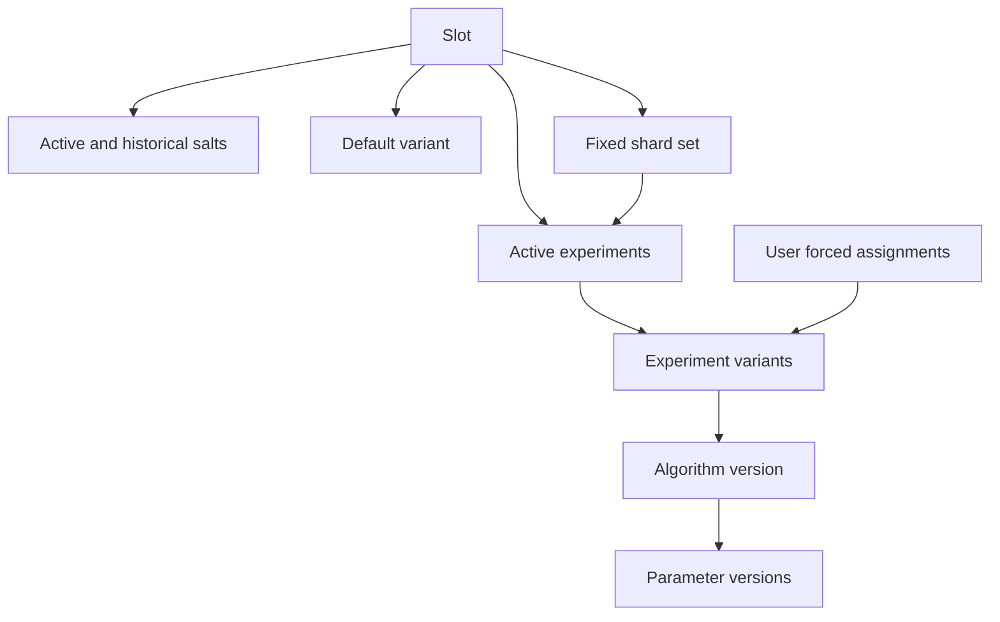

# Experiment management domain model

EMS records which immutable algorithm artifacts may run, groups them into stable decision slots, and describes active
experiments. It stores control-plane metadata in PostgreSQL; artifact bytes remain in external package and object
storage.

## Resource relationships

## Algorithms and parameters

An **algorithm record** identifies a named, versioned algorithm JAR and its immutable location. A separate
**algorithm-parameter record** identifies a parameter package and its immutable location. Multiple parameter versions
can belong to one algorithm version.

For an algorithm whose parameter mode is `REQUIRED`, the active slot response resolves each variant to its algorithm
and the latest registered parameter record for that algorithm version. A parameterless algorithm has parameter mode
`NONE` and omits both parameter fields.

A variant does not pin a parameter ID. Registering a newer parameter therefore changes the runtime resolved for every
variant using that algorithm version after clients refresh. See
[EMS operations and state transitions](../experiment-management-operations/index.md#understand-latest-parameter) before
registering a parameter for an algorithm already in use.

EMS stores locations and lifecycle metadata. Release automation uploads the bytes before registering those absolute
locations; the EMS API is not an artifact-upload endpoint.

## Slots

A **slot** is a stable decision point in a containing application, such as one ranking or retrieval position. It owns:

- one active default variant;
- a fixed number of numbered shards;
- one active salt and its salt history;
- zero or more active experiments;
- explicit user forced assignments.

The slot name is the integration contract used by the serving application. Its total shard count defines the
assignment hash space and is treated as immutable by a running online refresher.

## Variants

A **variant** connects a slot to one released algorithm version. The default variant is used when no experiment applies
or when a selected experiment has not admitted the request through ramp-up.

Experiment variants additionally carry:

- whether the variant is the experiment's control;
- a positive allocation ratio used as a relative weight;
- their owning experiment and slot.

Allocation ratios are weights, not percentages. Ratios `1`, `1`, and `2` divide admitted traffic into 25%, 25%, and
50%, respectively.

## Experiments

An **experiment** belongs to exactly one slot. Creation supplies:

- a name;
- the variants, with exactly one control variant;
- how many currently free slot shards to reserve;
- an initial ramp-up percentage.

The reserved shards determine which deterministic slot cohorts are eligible for the experiment. Terminating an
experiment releases those shards, deactivates its variants, and records the transition. EMS also records ramp-up and
shard history so operators can reconstruct how allocation changed over time.

## Salts and forced assignments

The active **slot salt** participates in every deterministic assignment hash. Refreshing it intentionally redistributes
non-forced traffic across shards, variants, and ramp-up buckets. Salt refresh is therefore an operational event and can
be disabled by deployment configuration.

A **user forced assignment** maps one stable assignment key to a variant in the slot. It has precedence over normal
shard, allocation, and ramp-up rules and is intended for explicit verification or tightly controlled operational use.

Continue with [Traffic assignment and ramp-up](../experiment-assignment/index.md) for the exact request-time order.
