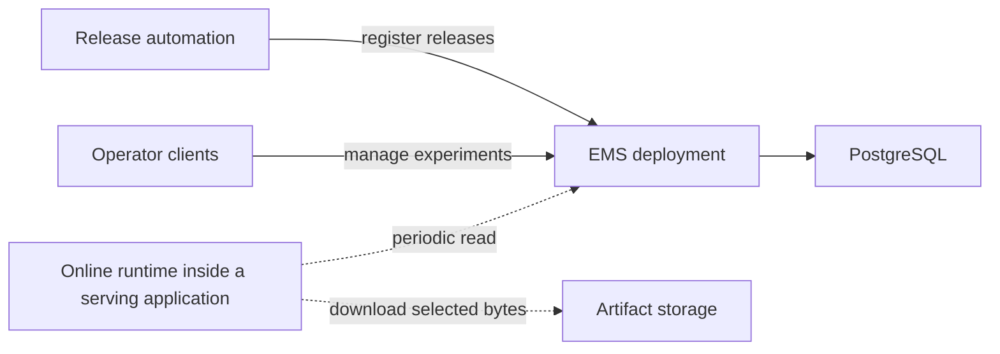
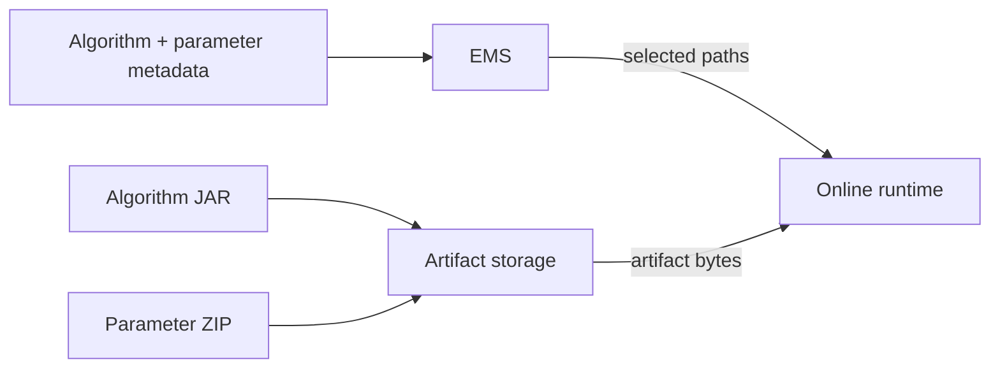

# Experiment management

The Experiment Management Service (EMS) is a control plane used with Hotvect to select released algorithm runtimes. It
stores algorithm and parameter metadata, slot configuration, variants, experiments, and assignment policy in
PostgreSQL and exposes them through a REST API.

The EMS server is a separately maintained and deployed application. It is not part of an algorithm JAR, it does not
run inside each algorithm project, and serving applications do not embed its implementation.

Use the component documentation according to the question you are answering:

- [Domain model](../experiment-management-domain/index.md): algorithms, parameters, slots, variants, experiments,
  shards, salts, and forced assignments.
- [Operations and state transitions](../experiment-management-operations/index.md): release state, latest-parameter
  behavior, promotion, experiment lifecycle, mutation side effects, endpoints, and audit history.
- [Traffic assignment and ramp-up](../experiment-assignment/index.md): how those resources select a variant.
- [Clients and operator tools](../ems-clients-and-tools/index.md): Java, Python, CLI, and OpenAPI surfaces.

## Position in the system



EMS is not on the per-request inference path. The online runtime periodically reads selection state, resolves every
referenced JAR and parameter package, and installs a local immutable serving snapshot. Requests are assigned and
executed from that local snapshot.

## What EMS owns

EMS owns the durable relationships between release identities and traffic configuration:

| Resource | Purpose |
| --- | --- |
| Algorithm | Names and versions an immutable algorithm release and records its JAR location |
| Algorithm parameter | Names trained or generated state for one algorithm release and records its parameter-ZIP location |
| Slot | Defines one decision surface, its salt, shard count, and stable default variant |
| Variant | Selects an exact algorithm and current parameter identity and carries assignment attributes |
| Experiment | Associates variants with a slot, shard allocation, variant allocation, and ramp-up |
| User forced assignment | Selects a variant for an explicit assignment key before normal allocation |
| Operational history | Records state transitions such as algorithm state, variant algorithm changes, shard changes, and ramp-up |

The exact schema is exposed through the deployed OpenAPI document. These resources form control-plane state; they do
not contain executable JAR or ZIP bytes.

## What EMS does not own

EMS deliberately does not own:

- algorithm source or compilation;
- model training, prediction, or evaluation;
- upload or download proxying for algorithm artifacts;
- the serving application's HTTP or event API;
- request decoding and feature hydration;
- per-request calls to the selected algorithm;
- the containing application's traffic fallback and admission policy;

Those boundaries keep the control plane independent of the latency-sensitive request path.

## Server source and deployment

The deployment owner maintains the EMS server implementation, persistence model, migrations, security, OpenAPI
generation, executable runtime, and delivery configuration. Hotvect does not publish or embed that server. Its runtime
and operator clients consume the deployed contract while source ownership, versioning, database evolution, and
deployment remain outside this repository.

## PostgreSQL and migrations

Production EMS uses PostgreSQL. The standalone application connects to the deployment's existing database using the
configured host, database, schema, user, and password.

Flyway owns schema evolution. The application applies versioned migrations and JPA validates the resulting schema. A
server upgrade should therefore point the new service image at the existing database and let the reviewed migration
chain advance it. It should not silently create a parallel replacement database or enable automatic JPA schema
generation.

Database backups, restore exercises, availability, connection pooling, network policy, and credential rotation belong
to the deployment owner.

## Artifacts are external

Algorithm and parameter records contain exact absolute artifact locations. Registration stores those paths; it does not
upload the corresponding files.



The server does not infer a parameter path from an algorithm name or deployment convention. Parameter registration must
provide `absolute_s3_path`, and algorithm registration must provide the absolute JAR path. See
[Artifact publication and storage](../artifact-publication-and-storage/index.md).

## API consumers

EMS has three main consumer classes:

1. **Online runtime clients** read the default variant and active experiments for configured slots. They do not mutate
   release or experiment state.
2. **Release automation** registers algorithm and parameter metadata and may connect an approved identity to a variant.
3. **Operator clients** inspect and, when authorized, manage slots, variants, experiments, ramp-up, and explicit user
   assignments.

The runtime read path is centered on:

```text
GET /slots/{slotName}/defaultVariantAndActiveExperiments
```

That response is a serving snapshot description. It contains the default variant, active experiments, shard and
allocation configuration, user forced assignments, and the artifact metadata needed to load each referenced runtime.

See [EMS clients and operator tools](../ems-clients-and-tools/index.md) for the available clients.

## Authentication and authorization

OAuth is enabled by default. The EMS application contains the deployment's token-introspection integration and maps
configured scopes to the API.

The server maps the configured read scope to `GET` and `HEAD` and the write scope to mutation methods. The deployment
owner must define actual scopes, credentials, token issuance, and network exposure appropriate for the environment.

Disabling OAuth is appropriate only for isolated local or documentation runs. It is not a production access-control
strategy.

## Runtime consistency

An EMS database transaction and an online serving snapshot have different lifetimes. Changing control-plane state does
not mutate an in-flight request or a previously installed algorithm object.

On refresh, the runtime:

1. fetches one slot snapshot from EMS;
2. identifies every algorithm and parameter referenced by the default and active variants;
3. downloads or reuses all required artifacts;
4. constructs all required algorithm instances;
5. atomically replaces the previous immutable slot snapshot.

If artifact resolution or construction fails, the new snapshot is not installed. The containing application decides
whether an initial failure prevents startup and how a later stale snapshot affects health and traffic.

## Version boundaries

The EMS application has its own version and release cycle. A Hotvect release can update clients without publishing an
EMS server, and an EMS release can update persistence, API, security, or deployment behavior without becoming a
Hotvect module.

Coordinate upgrades across:

- the EMS server release;
- database migrations included in that release;
- deployed service configuration;
- online clients that deserialize the runtime read response;
- Python clients and automation that use mutation endpoints.

Deploy the server before requiring a newly introduced API from clients. Preserve existing runtime read
contracts unless the client rollout is explicitly coordinated.

## Operational checks

A production EMS deployment should expose separate application and management ports or equivalent health boundaries.
At minimum, verify:

- the application starts against the existing PostgreSQL schema;
- Flyway completes and JPA schema validation succeeds;
- OAuth rejects unauthenticated requests and accepts the intended scopes;
- the generated OpenAPI document carries the deployment's identity and server URLs;
- the runtime slot-state endpoint returns the expected default and active experiments;
- backup and restore ownership is documented;
- online runtimes have separate read credentials and artifact-store read access.

Continue with [Runtime client, refresh, and assignment](../ems-runtime-client/index.md) for the serving side.
