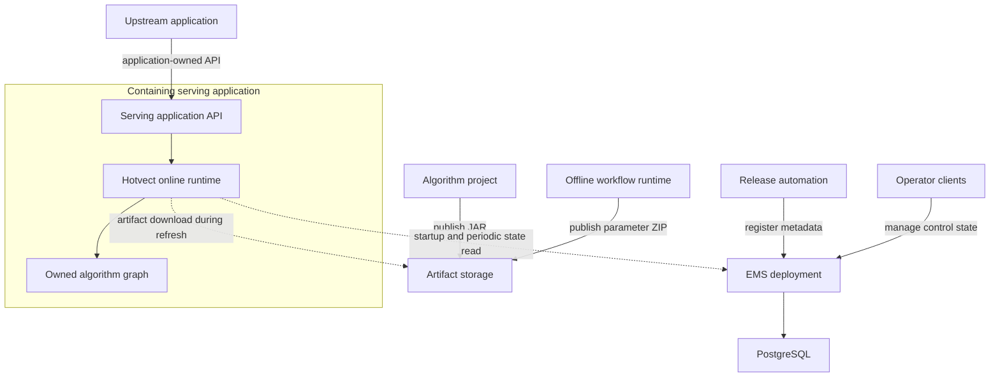

# Hotvect system components

Hotvect's lifecycle uses five cooperating component areas. Start with the phase you are working in, then choose the
component involved. Experiment management is a separately owned service integration; the other areas are Hotvect
framework surfaces. Together they carry a decision algorithm from implementation through offline evidence to
application execution and, when used, experimentation.

| Component area | What it owns |
| --- | --- |
| [Algorithm SDK and packages](algorithm-package/index.md) | Java APIs, composition, algorithm definitions, feature logic, backend modules, the JAR contract, and versioned packaging |
| [Developer tools](developer-tools/index.md) | `hv`, `hv-ext`, `hv algorithm serve`, `hv-mcp`, local development, inspection, and debugging |
| [Offline workflows](offline-workflow-runtime/index.md) | State generation, training, prediction, evaluation, backtests, local execution, and managed batch execution |
| [Online runtime integration](../architecture/online-runtime/index.md) | The Java runtime embedded by a containing application to resolve, load, bind, cache, select, and execute algorithms |
| [Experiment management](experiment-management-service/index.md) | The separately deployed EMS control plane, slots, experiments, assignment configuration, and operator interfaces |

These areas do not have the same deployment form. An algorithm package is an artifact, the developer tools are local
commands, the online runtime is an embedded library, and EMS is a separately deployed service.

The most important distinction is between the **control plane** and the **request path**. The Experiment Management
Service (EMS) stores release and experiment configuration. A containing serving application embeds the online runtime,
periodically reads EMS, downloads the selected artifacts, and executes the algorithm locally for each request.

## Deployment map

The upstream application and the containing serving application are integration roles, not Hotvect-owned components. Their
transport APIs, authentication, traffic controls, request adaptation, and operational behavior belong to their owners.

## Supporting system pieces

The component areas assemble the following technical pieces. Artifact storage, release automation, and the containing
application are important parts of the system, but they are not additional Hotvect components.

| Component | Form | Runs where | Owns | Does not own |
| --- | --- | --- | --- | --- |
| [Algorithm package](algorithm-package/index.md) | Versioned JAR | Loaded by offline or online runtimes | Algorithm definitions, factories, feature logic, selected backends | HTTP serving, experiments, artifact selection |
| [Offline workflow runtime](offline-workflow-runtime/index.md) | Python CLI plus Java offline runtime | Developer machine or batch job | Train, predict, evaluate, backtest, workflow outputs | Online traffic or experiment assignment |
| [Artifact publication and storage](artifact-publication-and-storage/index.md) | Release workflow plus object/package storage | CI, batch jobs, external stores | Immutable JAR and parameter bytes | Experiment semantics or request execution |
| [Online runtime](../architecture/online-runtime/index.md) | Java libraries embedded in an application | Containing serving application | Loading, dependency binding, local execution, runtime reuse | The application's network API and traffic policy |
| [EMS control plane](experiment-management-service/index.md) | Separately deployed Spring Boot application | Dedicated service deployment | Release metadata, slots, variants, experiments, assignment configuration | Artifact bytes or per-request inference |
| [EMS runtime client](ems-runtime-client/index.md) | Part of `hotvect-online-util` | Containing serving application | State refresh, artifact resolution, immutable serving snapshots, local assignment | EMS mutations or artifact publication |
| [EMS clients and tools](ems-clients-and-tools/index.md) | Python library and CLIs | Automation or operator environment | Authorized control-plane operations and inspection | Online algorithm execution |
| [Local algorithm server](local-algorithm-server/index.md) | `hv algorithm serve` plus a JVM server | Development environment | Local HTTP execution and browser debugging | Production hosting controls |

## Put dependencies in the right project

| Dependency or artifact | Where it belongs |
| --- | --- |
| `hotvect-api`, implementation modules, and selected runtime-provided utilities | Algorithm project, according to the [JAR ownership contract](../concepts/jar-loading/index.md) |
| `hotvect-offline-util` | Offline runner or algorithm project as a runtime-provided compile contract |
| `hotvect-online-util` | Containing serving application; algorithm projects may use it as a runtime-provided compile contract |
| Standalone EMS server | Dedicated EMS repository and service deployment |
| Algorithm JAR and parameter ZIP | Artifact storage, referenced by immutable metadata |

Adding EMS server code to an algorithm or serving project is not a supported integration. An algorithm project
produces an artifact, a serving application embeds the runtime client, and the dedicated EMS repository builds and
deploys the control-plane application.

## Choose a starting point

- Algorithm authors: start with [Algorithm SDK and packages](algorithm-package/index.md).
- Developers looking for a command or debugger: start with [Developer tools](developer-tools/index.md).
- Training and evaluation owners: start with [Offline workflows](offline-workflow-runtime/index.md).
- Serving-application engineers: start with [Online runtime integration](../architecture/online-runtime/index.md) and
  [Connect an online runtime to EMS](../guides/connect-online-runtime-to-ems/index.md).
- EMS deployment and experiment owners: start with [Experiment management](experiment-management-service/index.md) and
  the deployment owner's service documentation.
