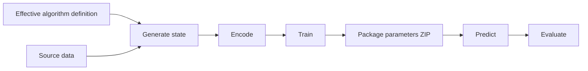

# Offline workflows

Offline workflows execute complete Hotvect algorithms for state generation, encoding, training,
prediction, evaluation, and performance work. It combines Python orchestration with Java execution from
`hotvect-offline-util` and the selected [algorithm package](../algorithm-package/index.md).

It can run on a developer machine or managed batch compute such as SageMaker. It is not a permanently deployed request
service.

## Inputs and outputs

An offline run resolves:

- an algorithm JAR and embedded algorithm definition;
- an optional explicit definition override;
- source data for the selected dates or partitions;
- a local or remote execution environment;
- cached or pinned intermediate artifacts when requested.

The workflow may produce generated state, encoded data, trained model files, predictions, evaluation results, logs, and
manifests. Its main reusable serving output is normally the predict-parameters ZIP.

Not every algorithm executes every stage. A parameterless policy may skip training, while a stateful retrieval
algorithm may spend most of its time generating and packaging state.

## Local and remote execution

The same logical workflow can run on a developer machine or as a remote batch job. Remote execution packages the job,
submits it to the configured environment, and collects results. It does not convert a child dependency into a generic
request-time remote service.

The offline runtime owns workflow retries, scratch layout, caching, and batch-job metadata. The selected compute
environment owns machine resources, credentials, and job-level isolation.

## Relationship to EMS

Training and backtesting do not require EMS. They can operate directly on a JAR, definition, data, and parameter
artifacts.

EMS becomes relevant when an approved algorithm and parameter identity is published for selection by an online runtime.
Publication automation uploads the bytes to artifact storage and registers their immutable metadata with EMS. EMS does
not run the training pipeline and does not receive the parameter bytes through its control-plane API.

## Relationship to online serving

Offline and online execution share the algorithm package and parameter contents, but they do not share a process or
transport path. The online runtime uses realtime execution context and application-owned request adaptation. The offline
runtime uses recorded or batch input and may execute training-only factories and decoders.

Parity therefore requires more than loading the same JAR. Record the effective definition, parameter identity, source
representation, execution context, and external dependencies for any comparison.

Continue with [Offline lifecycle](../../architecture/offline-lifecycle/index.md) for the full architecture or
[Pipeline stages](../../guides/pipeline-stages/index.md) for the concrete outputs of each stage.
