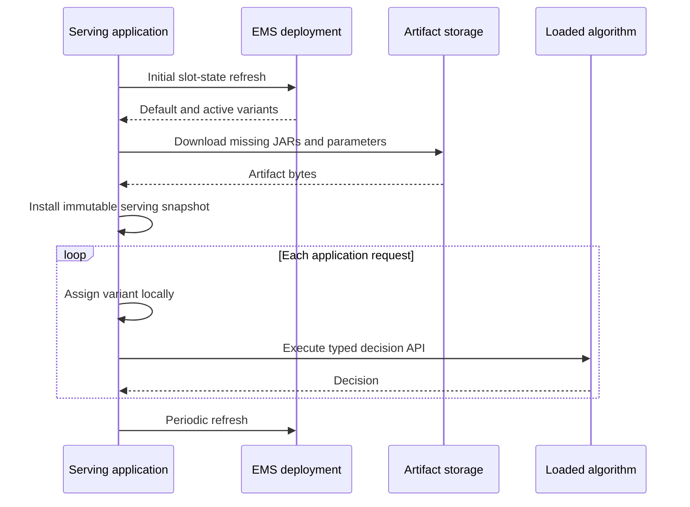

# Connect an online runtime to EMS

This guide adds EMS-backed runtime selection to a containing Java serving application. The application embeds
`hotvect-online-util`, reads control state from a separately deployed EMS endpoint, downloads selected JAR and parameter
artifacts, and executes the selected algorithm locally.

The serving application does not embed the EMS server and does not call EMS for every request.

## Runtime flow



## 1. Add the online runtime dependency

Add `hotvect-online-util` to the containing serving application:

```groovy
dependencies {
    implementation "com.hotvect:hotvect-online-util:${hotvectVersion}"
}
```

or:

```xml
<dependency>
  <groupId>com.hotvect</groupId>
  <artifactId>hotvect-online-util</artifactId>
  <version>${hotvect.version}</version>
</dependency>
```

Use the same Hotvect version as the algorithm packages selected for this application. The application also owns its
logging, Jackson, Guava, AWS SDK, HTTP server, and public contract dependencies.

Do not add or copy the EMS server implementation; it is built and deployed from the dedicated EMS repository.

## 2. Configure the external dependencies

The serving application needs:

| Setting | Purpose |
| --- | --- |
| EMS base URL | Root URL of the deployed control plane |
| EMS token supplier | Read credential refreshed by the application's identity integration |
| Connect and read timeouts | Bound control-plane startup and refresh calls |
| Slot names | Decision surfaces this process is prepared to serve |
| Refresh period | Maximum intended interval between successful state reads |
| Scratch directory | Temporary JAR and parameter downloads |
| Optional local-state root | Private materialized state for algorithms that declare the capability |
| Artifact-store client | Read access to every path registered for the configured slots |

The EMS token and artifact-store credentials are separate capabilities. EMS returns metadata; the artifact-store client
downloads the bytes. `applicationS3Client()`, `tokenProvider`, and later application-owned bindings are placeholders for
the containing application's infrastructure.

## 3. Build one shared algorithm repository

Create one `AlgorithmRepository` for the application and share it across all slots:

```java
import com.hotvect.onlineutils.experimentmanagement.algodownload.AlgorithmDownloader;
import com.hotvect.onlineutils.experimentmanagement.algodownload.AlgorithmRepository;
import com.hotvect.onlineutils.experimentmanagement.algodownload.S3AlgorithmDownloadClient;
import java.nio.file.Path;
import java.util.Optional;
import software.amazon.awssdk.services.s3.S3AsyncClient;

S3AsyncClient s3Client = applicationS3Client();
var downloadClient = new S3AlgorithmDownloadClient(s3Client);
var downloader = new AlgorithmDownloader(
        downloadClient,
        Path.of("/var/run/application/hotvect-scratch"),
        Optional.of(Path.of("/var/lib/application/hotvect-state")),
        ServingApplication.class.getClassLoader(),
        true);

var algorithmRepository = new AlgorithmRepository(downloader);
```

The final `true` enables strict algorithm-version checking. Use an empty optional local-state root only when no selected
algorithm declares `requires_local_state_storage: true`.

The application that creates `S3AsyncClient` keeps it alive while refreshes can occur and closes it during shutdown.

## 4. Bind application-owned capabilities

When an algorithm depends on an application-provided capability, bind it once when creating the repository:

```java
import com.hotvect.api.algodefinition.AlgorithmInstance;
import java.util.Map;

AlgorithmInstance<?> featureStoreBinding = AlgorithmInstance.externalAlgorithm(
        "feature-store",
        applicationFeatureStore);

var algorithmRepository = new AlgorithmRepository(
        downloader,
        Map.of("feature-store", featureStoreBinding));
```

The dependency name must match the algorithm definition. The containing application remains responsible for the bound
object's transport, credentials, timeouts, metrics, failures, and lifecycle.

## 5. Create the EMS client and manager

```java
import com.hotvect.onlineutils.experimentmanagement.experimentation.DefaultExperimentationManager;
import com.hotvect.onlineutils.experimentmanagement.httpclient.ExperimentManagementServiceClient;
import java.net.URI;
import java.time.Duration;
import java.util.Set;

var emsClient = new ExperimentManagementServiceClient(
        URI.create("https://experiments.example.com"),
        Duration.ofSeconds(5),
        Duration.ofSeconds(10),
        tokenProvider::currentToken);

var experimentationManager = new DefaultExperimentationManager(
        algorithmRepository,
        Duration.ofMinutes(5),
        emsClient,
        Set.of("example-slot"));
```

One manager may own several configured slots. It shares the repository and EMS client while maintaining a separate
refresher and immutable snapshot for each slot.

## 6. Load initial state before accepting traffic

```java
experimentationManager.startAsync().awaitRunning();
```

Startup reads every configured slot and resolves all algorithms referenced by its default variant and active
experiments. The manager reaches `RUNNING` only after all initial snapshots are complete.

If the EMS call, artifact download, identity validation, dependency binding, or algorithm construction fails, startup
fails. Do not mark the application ready without a serving snapshot unless the application has an explicit independent
mode that does not use those slots.

When several slots are configured, startup and explicit `refreshAllNow()` process them sequentially. There is no global
atomic swap across slots.

## 7. Assign and execute locally

For each application request, supply the slot and the stable assignment key chosen for that product surface:

```java
import com.hotvect.onlineutils.experimentmanagement.models.VariantConfiguration;

VariantConfiguration selected = experimentationManager.assignVariant(
        "example-slot",
        assignmentKey);

int variantId = selected.variant().variantId();
var algorithmInstance = selected.algorithmInstance();
var algorithm = algorithmInstance.algorithm();
```

The assignment reads only the current in-memory snapshot. It applies explicit user assignment, shard selection,
experiment and variant allocation, and ramp-up rules locally.

Cast and call the selected algorithm through the typed contract expected by the containing application. Include the
variant, algorithm, and parameter identities in request attribution and observability so an online decision can be
connected to its release and experiment.

Keep a strong reference to the selected `AlgorithmInstance` for as long as its algorithm is used. Do not close a
repository-returned instance per request.

## 8. Expose refresh health

Later refreshes preserve the last successfully installed snapshot when an EMS read or artifact resolution fails. The
application should expose at least:

- the update time of the current snapshot for each slot;
- the last refresh failure time and cause;
- the selected default and active runtime identities;
- artifact scratch and local-state capacity;
- whether the initial refresh completed.

`DefaultExperimentationManager` exposes the current snapshot but not structured last-failure details through its public
manager interface. Its per-slot refresher logs background failures. If the application requires exact last-failure data
on a health endpoint, make that an explicit part of its refresher integration rather than claiming the default manager
already exposes it.

Define a staleness threshold and decide how it affects readiness, alerts, and traffic. Continuing with the last known
snapshot is not the same as a successful refresh and should remain observable.

## 9. Shut down in ownership order

```java
experimentationManager.close();
emsClient.close();
downloadClient.close();
s3Client.close();
```

Stop the manager before closing clients it may use during refresh. Close application-owned dependency bindings according
to their own lifecycle.

## Verification checklist

Before enabling traffic, verify:

- the application depends on `hotvect-online-util`, not the EMS server;
- each configured slot performs a successful initial refresh;
- both default and active experiment artifacts load with strict version validation;
- the application can read every registered artifact path;
- assignment is stable for a fixed key and changes only under the expected control-plane rules;
- request execution performs no EMS or artifact-store network call;
- refresh failures retain the previous snapshot and are visible in health and alerts;
- application-provided dependencies are exercised in an integration test;
- shutdown stops refreshers before closing clients.

Continue with [Online runtime integration](../../architecture/online-runtime/index.md) for loading and
class ownership details.
