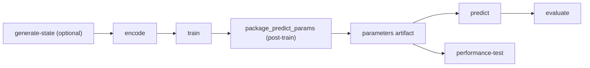
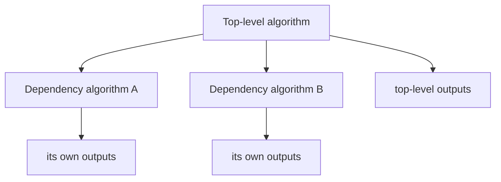

# How to: Understand the Hotvect pipeline stages

Hotvect's offline pipeline is easiest to understand if you think about **artifacts**, not commands.

## What the pipeline is trying to produce

Which artifact matters most depends on why you are running the pipeline. The two most common cases are a **production run** and a **backtest**.

For a **production run**:

- the goal is to produce parameters you can deploy or otherwise use in production
- the main final output is usually the `predict-parameters ZIP`
- that ZIP is the artifact later reused by prediction/serving
- this run is often close to the live edge, so the target test slice may not exist yet
- in that case, Hotvect still builds the ZIP but skips `predict`, `evaluate`, and `performance-test` because there is no test data to run against

For a **backtest**:

- the goal is to answer "how would this algorithm have performed on past data?"
- you run the pipeline on one or more historical test days where the outcomes are already known
- the main final output is usually the evaluation result for those historical days
- predictions may still be written, but they are usually a supporting artifact for debugging or deeper analysis
- the `predict-parameters ZIP` is still produced along the way, but it is usually an intermediate artifact rather than the thing you care about most
- the run metadata becomes especially important because it records the quality results you want to compare, and if performance testing is enabled also the system-behavior results

A run leaves behind two different kinds of artifacts:

- **outputs** under `out/...`: artifacts that later stages or other systems consume, such as generated state, encoded data, predictions, and the `predict-parameters ZIP`
- **metadata** under `meta/...`: logs, timings, per-stage metadata, and run summaries that explain what happened

Some algorithms also produce extra state or intermediate encoded training data along the way.

### Parameters vs hyperparameters

- **parameters** are the values or files that inference needs later, such as model weights, tree ensembles, lookup tables, thresholds, or generated state. Concrete examples: a TensorFlow SavedModel directory, or in Hotvect v10 CatBoost a model file packaged under `model_parameter/model.parameter`.
- **hyperparameters** are choices made before training that affect how those parameters are produced, such as learning rate, tree depth, or number of training iterations. Concrete examples: in TensorFlow, `learning_rate=0.001`, `batch_size=512`, or `epochs=5`; in CatBoost, `depth=8` or `iterations=500`.

For this guide, the important idea is simple: the pipeline mostly exists to produce **parameters**. Hyperparameters influence the run, but they are not the main artifact this page is about.

### What is the parameters artifact?

After `train`, Hotvect usually runs a packaging step that bundles inference-time files into a ZIP. That ZIP is the main reusable output of the run. In other docs and logs, you will often see this described as the **predict-parameters ZIP**.

In `result.json`, that packaging step appears as `package_predict_params`. This guide keeps the familiar six-stage framing, so it treats packaging as the bridge between `train` and the inference-facing stages rather than as a separate seventh stage.

Later steps such as `predict` and `performance-test` use that artifact, and serving typically uses the same underlying contents. Depending on the algorithm, the ZIP may contain model files, generated state, or other supporting files needed at inference time. Concrete examples include a TensorFlow SavedModel directory containing `saved_model.pb` or a CatBoost model under `model_parameter/model.parameter`. The ZIP filename itself follows the pattern `<hyperparameter_slug>@<parameter_version>.parameters.zip`.

### One run, viewed as an artifact chain

| Stage | Main output | Why it exists |
|---|---|---|
| `generate-state` | state artifacts such as `category_id_mapping.json`, `openclip_model/`, or `popularity_counts.tsv` | prepares generated state needed downstream |
| `encode` | `encoded/` shards such as `shard_0.tfrecord`, `shard_0.tsv`, or `shard_0.jsonl` | serializes training data into the files/directories the training library reads |
| `train` | model artifacts under `model_parameter/`, such as `model_parameter/saved_model.pb` | produces model files that Hotvect later packages into the reusable inference-time artifact |
| `predict` | `prediction.jsonl` | shows what the trained artifact outputs on the test slice |
| `evaluate` | `evaluate/metadata.json` with metrics such as AUC or NDCG | tells you whether those predictions are good |
| `performance-test` | `performance-test/metadata.json` with metrics such as `p50`, `p95`, `p99`, and throughput | tells you whether the artifact is fast and stable enough |

## One run is anchored on a test day

`last_test_time` is the anchor date for the run.

The simplest interpretation is:

- **test data** usually comes from `last_test_time` itself
- **training data** usually comes from earlier dates
- the folder name `last_test_date_YYYY-MM-DD` is how Hotvect labels that run on disk

Example:

- `last_test_time = 2025-08-09`
- `training_lag_days = 1`
- `number_of_training_days = 7`

Then Hotvect typically:

- evaluates on test data for `2025-08-09`
- trains on data from `2025-08-02` through `2025-08-08`

So `last_test_time` does **not** mean "the last day of training". It means "the day I want to test/evaluate against", and training is derived relative to that day.

If you run `hv backtest`, Hotvect repeats this historical run across multiple git references and/or dates.

## One top-level algorithm run

In most workflows, you start by naming one algorithm. Hotvect treats that as the **top-level algorithm run** and orchestrates the offline work needed to make that algorithm usable.

This is the core mental model:

- training writes model artifacts such as files under `model_parameter/`
- Hotvect then packages those inference-time files into a ZIP such as `<hyperparameter_slug>@<parameter_version>.parameters.zip`
- prediction shows what that artifact outputs
- evaluation judges output quality
- performance testing judges runtime behavior

Some runs skip visible stages:

- state-only algorithms do `generate-state` instead of the `encode` -> `train` -> `predict` -> `evaluate` flow
- cached or pinned parameters may let Hotvect skip `encode` and `train`
- if no test data is available for the anchor day, Hotvect skips `predict`, `evaluate`, and `performance-test`
- `performance-test` may be disabled during iteration

## Advanced: one top-level algorithm can depend on other algorithms

One algorithm can rely on the outputs of other algorithms. In Hotvect terminology, these are often described as **outer/top-level** and **inner/dependency** algorithms. You may also hear dependency algorithms described as **child algorithms**.

Conceptually:

- the **top-level algorithm** is the public entrypoint you care about
- **dependency algorithms** do supporting work such as state generation, feature engineering, or model training
- Hotvect prepares those dependencies before continuing with the top-level algorithm

Typical reasons to have dependency or child algorithms include:

- the top-level algorithm adds heuristics or business rules on top of lower-level model outputs
- the top-level algorithm is an ensemble that combines the outputs of multiple child models
- one child algorithm produces features or embeddings that another child algorithm consumes, such as an OpenCLIP-style model producing vectors for a CatBoost model

The main practical consequence is simple:

- `hv train` usually makes sense at the top-level algorithm
- low-level commands such as `hv encode` usually target the inner algorithm that actually owns the training command

If you are unsure where to start, start with the top-level algorithm and only drop to a dependency algorithm when you need to debug a specific lower-level stage.

## Training path vs inference path

The training path and the inference path are deliberately not symmetrical.

During **training**, Hotvect writes the encoded training dataset to disk. That is useful because:

- some trainers need to read the same encoded data more than once
- the encoded dataset is inspectable, which makes debugging easier

During **predict**, feature transformation still happens, but Hotvect normally does **not** materialize a standalone encoded test dataset on disk first. It transforms inputs and scores them directly, which is closer to how production inference works.

## The six stages

### `generate-state`

- **Purpose**: build generated state artifacts from source data
- **Main output**: state files or directories such as `category_id_mapping.json`, `openclip_model/`, or `popularity_counts.tsv`
- **Why the next stage cares**: downstream algorithms may need that state during training or inference

Not every algorithm has this stage. It exists for **state algorithms** whose job is to materialize already-available or directly derived artifacts rather than run the ML pipeline. Typical examples are creating a category-ID mapping table, copying a pre-trained OpenCLIP model into the expected layout, or computing aggregates/statistics such as popularity counts.

A state algorithm does **not** have its own `encode`, `train`, `predict`, `evaluate`, or `performance-test` flow. Its job is to produce the state artifact. Hotvect may still package that artifact afterward so a parent algorithm or serving system can reuse it.

### `encode`

- **Purpose**: serialize raw training examples into the files or directories the training ML library understands
- **Main output**: an `encoded/` directory containing shard files such as `shard_0.tfrecord`, `shard_0.tsv`, or `shard_0.jsonl`, plus a schema description file such as `encoded-schema-description` or `column_description.tsv`
- **Why the next stage cares**: `train` consumes these serialized encoded files instead of the raw source data

In Hotvect v10, encoded output is directory-based and sharded rather than a single file. The shard naming pattern is `shard_<index><ext>`, for example `shard_0.tfrecord`, `shard_0.tsv`, or `shard_0.jsonl`.

### `train`

- **Purpose**: run the algorithm's training command and fit the model
- **Main output**: library-specific model artifacts under `model_parameter/`, such as a TensorFlow SavedModel directory containing `model_parameter/saved_model.pb` or a CatBoost model file that Hotvect later packages as `model_parameter/model.parameter`
- **Why the next stage cares**: Hotvect packages these model files into the ZIP that `predict`, `performance-test`, and later serving use

This is the stage where Hotvect turns "training data + algorithm logic" into the files produced directly by the training library. For example, a TensorFlow trainer may write a SavedModel directory under `model_parameter/` with `saved_model.pb`, while a CatBoost trainer may write a model file that Hotvect later packages under `model_parameter/model.parameter` in v10. After `train`, Hotvect runs the packaging step and writes the reusable ZIP.

### `predict`

- **Purpose**: apply the trained artifact to test or validation data
- **Main output**: `prediction.jsonl`, typically containing one predicted score, rank, or similar output per test example
- **Why the next stage cares**: `evaluate` converts those predictions into quality metrics

`predict` does not retrain or improve the model. It only runs inference with the parameters artifact.

### `evaluate`

- **Purpose**: turn predictions into quality metrics
- **Main output**: `meta/.../evaluate/metadata.json`, typically containing metrics such as AUC, NDCG, precision/recall, or task-specific scores
- **Why it exists**: raw predictions are not enough; you need metrics to compare model quality

If `predict` answers "what did the model output?", `evaluate` answers "was that output good?"

### `performance-test`

- **Purpose**: measure system behavior using the trained artifact
- **Main output**: `meta/.../performance-test/metadata.json`, typically containing runtime measurements such as `p50`, `p95`, and `p99` latency, plus throughput and similar serving metrics
- **Why it exists**: good model quality is not enough if the algorithm is too slow or unstable to serve

This stage is about system behavior, not model quality. Think "How fast is inference?" and "What does tail latency look like?", not "Is the ranking good?"

## What to inspect after a run

The most useful things to look at after a run are:

- the `predict-parameters ZIP`: the main reusable output
- `prediction.jsonl`: what the trained artifact produced on the test slice
- `result.json`: the run summary showing which stages ran or were skipped
- `hv.log` and per-stage logs: what the pipeline actually did

Hotvect typically writes data artifacts under `out/...` and logs/metadata under `meta/...`. If you need exact paths and directory layouts, use the [CLI reference](../../reference/cli/index.md).

When Hotvect says **metadata**, think "explanation of the run", not "model artifact".

- `result.json` is the top-level run summary. It usually tells you which algorithm/date you ran, includes per-stage entries such as `dependencies`, `encode`, `train`, `package_predict_params`, `predict`, `evaluate`, and `performance_test`, and records `timing_info_sec`. If a stage did not run, this is often where you will see the `skipped` reason first.
- each stage's `metadata.json` is a lower-level summary for that one stage. The exact fields vary by stage, but they usually answer questions such as: did the stage run or reuse cache, what sources or parameters did it use, and what did it produce?
- some stage metadata is very stage-specific. For example, `train/metadata.json` records the effective training command, while `evaluate/metadata.json` is usually the metrics dictionary itself.

## Quality vs system behavior

Two questions matter, and they are not the same:

- **Quality question**: "Did the model rank or score the examples correctly?" -> `predict` + `evaluate`
- **System question**: "Is the algorithm fast and stable enough to run?" -> `performance-test`

You usually need both before trusting a new algorithm version.

## A practical workflow

1. Start with `hv train` to produce the parameters artifact and basic run outputs.
2. If the run fails, identify which stage failed.
3. If the problem looks like feature engineering or training input, inspect `encode`.
4. If the model trains but behavior looks wrong, inspect `predict` and `evaluate`.
5. If quality is acceptable, run `performance-test` before rollout.

## See also

- [CLI reference](../../reference/cli/index.md)
- [Reuse existing outputs](../reuse-outputs/index.md)
- [Parent-child algorithms](../patterns/parent-child/index.md)
